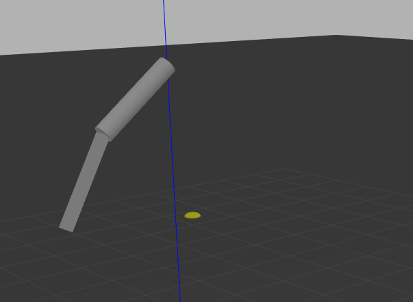

# Gazebo reading joints example


We have a `gazebo_example_plugins` repository folder where we will store the files.

To demonstrate this example, I will use a double pendulum. We will copy the double pendulum model from https://github.com/simbody/simbody/blob/master/examples/Gazebo2Simbody/models/double_pendulum.sdf into a file and name it `double_pendulum.world` and place it in the `world` folder. Additionally, we may also refactor a bit to keep the world files and the model files separate. So we will create the double pendulum model in the models folder and have a double pendulum world include the corresponding model.

Add the path where you created the `double_pendulum.world` to the `GAZEBO_RESOURCE_PATH`,

```
export GAZEBO_RESOURCE_PATH=$GAZEBO_RESOURCE_PATH:<path-to-repo-folder>/world
export GAZEBO_MODEL_PATH=$GAZEBO_MODEL_PATH:<path-to-repo-folder>/models
```


Now, simply running `gazebo --verbose double_pendulum.world` should add the model into the simulator where the model is simply controlled by gravity.




Now we will create a plugin to list the joint names and link names of the pendulum.

To compile the plugin, from the root folder of the project, run

```
mkdir build
cd build
cmake ..
make
```

If the compilation is successful, check if `libmodel_info.so` is created in the `build` folder. This is the plugin we will add to the double pendulum model in the `double_pendulum.world`. Add the following line anywhere between `<model name="double_pendulum">` and `</model>` tags in the `.world` file, preferably at the end.

```xml
<plugin name="model_info" filename="libmodel_info.so"/>
```


Now, we expose the plugin to Gazebo by updating the gazebo plugin path.

```
export GAZEBO_PLUGIN_PATH=$GAZEBO_PLUGIN_PATH:<path-to-repo-folder>/build
```

Note that this is not a good practice. A good practice will involve installing the `.so` files and the world files in an `install` folder and expose that folder to the users of this library instead of exposing the `build` folder.


Now, running the Gazebo world,

```
gazebo --verbose double_pendulum.world
```


will print the following repeatedly on the terminal,

```
List of Joints: 
- world_to_upper_pin_joint
- upper_to_lower_pin_joint
List of Links: 
- upper_link
- lower_link
```

This is printed repeatedly since the corresponding logic is added in a callback function `OnUpdate()` within the plugin that is called repeatedly throughout the use of the model in the Gazebo world. However, for typical and correct operations, such data collection of configuration parameters or data that will not be changed, this logic must be implemented in `Load()` method which is called only once while loading the plugin.
